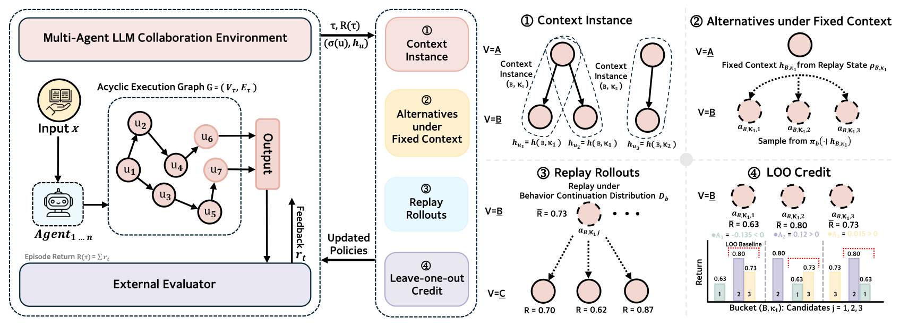
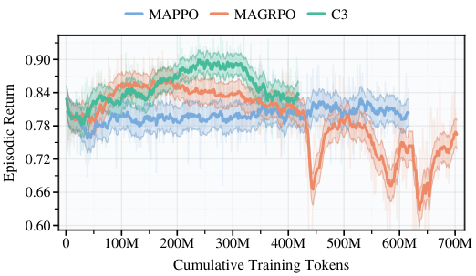
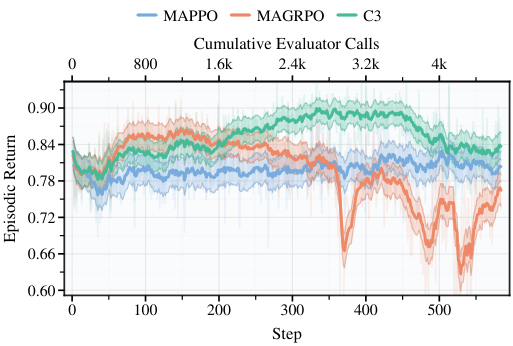

<div align="center">
  
  <p><strong>Contextual Counterfactual Credit Assignment</strong></p>
  <p>
    <a href="docs/IMPLEMENTATION_AUDIT.md"></a>
    <a href="docs/RELEASE_POLICY.md"></a>
    <a href=".github/workflows/ci-lite.yml"></a>
    <a href="LICENSE"></a>
    <a href="pyproject.toml"></a>
  </p>
  <p>
    <a href="docs/GETTING_STARTED.md">Getting Started</a> •
    <a href="docs/CODE_MAP.md">Code Map</a> •
    <a href="docs/IMPLEMENTATION_CHECKLIST.md">Implementation Checklist</a> •
    <a href="docs/RELEASE_CHECKLIST.md">Release Checklist</a>
  </p>
</div>

Reference implementation for the paper **Contextual Counterfactual Credit Assignment for Multi-Agent Reinforcement Learning in LLM Collaboration**.

## TL;DR

Cooperative multi-agent systems powered by large language models (LLMs) are frequently optimized via sparse terminal-only feedback, which entangles upstream decisions and obstructs accurate credit assignment. **C3** (Contextual Counterfactual Credit Assignment) addresses this trajectory-level diffusion by isolating the causal impact of individual messages. Instead of distributing rewards across an entire episode, C3 freezes the exact transcript-derived context, evaluates context-matched alternatives via fixed-continuation replay, and applies a leave-one-out (LOO) baseline. This localized intervention extracts unbiased, low-variance marginal advantages for standard policy-gradient optimization, improving both terminal performance and credit fidelity across mathematical and coding benchmarks.

<p align="center">
  <a href="#core-mechanism">Mechanism</a> •
  <a href="#key-results">Results</a> •
  <a href="#30-second-quickstart">Quickstart</a> •
  <a href="#main-workflows">Workflows</a> •
  <a href="#audit-and-release-checks">Release Gate</a>
</p>

## Core Mechanism

<div align="center">
  
</div>

**Figure 1**: C3 mechanism overview. Protocol-level replay, fixed-context alternatives, and leave-one-out credit assignment.

## Key Results

<div align="center">
  
  &nbsp;
  
</div>

**Main paper results**: Sample-efficiency and performance trajectories against baseline methods (e.g., MAPPO, MAGRPO). C3 reaches superior performance given matched training token budgets.

## Repository Purpose

`C3` is a paper-aligned research codebase designed to support:

- **Protocol Reproduction**: Executing the multi-agent task protocols described in the paper.
- **Experiment Execution**: Running full training sweeps, evaluation-only probes, and performance analyses.
- **Implementation Audit**: Providing a transparent mapping from theoretical mechanisms to executable code.
- **Extension and Testing**: Modifying or testing the framework without relying on private paths or bundled artifacts.

## Release Scope

To maintain a clean public-release surface, this repository does **not** distribute:
- Prepared datasets
- Trained model checkpoints
- Cached model weights
- Generated run-time artifacts (e.g., run logs, checkpoints, reports, and experiment outputs)

Corresponding local directories (`data/`, `artifacts/`, `ckpt/`, `runs/`, `wandb/`, `models/`) are treated as local working outputs and remain empty or absent in the public release. For details, see the [Release Policy](docs/RELEASE_POLICY.md).

## Repository Structure

- [c3/](c3/): Core C3 implementation, including multi-agent protocol handling, environments, credit assignment logic, and analysis tools.
- [openrlhf/](openrlhf/): Vendored upstream RLHF training stack, augmented with C3-specific integration points.
- [configs/](configs/): Configurations for tasks, roles, analyses, execution registries, and data manifests.
- [scripts/](scripts/): Entrypoints for data preparation, experiment reproduction, model utilities, and release gating.
- [docs/](docs/): Documentation covering release policies, implementation audits, upstream provenance, and data-source contracts.

## Quick Navigation

- **New User**: [Getting Started Guide](docs/GETTING_STARTED.md)
- **Code Layout**: [Code Map](docs/CODE_MAP.md)
- **Paper-to-Code Mapping**: [Implementation Audit](docs/IMPLEMENTATION_AUDIT.md)
- **Development Invariants**: [Implementation Checklist](docs/IMPLEMENTATION_CHECKLIST.md)
- **Data Provenance**: [Data Sources](docs/DATA_SOURCES.md)
- **Release Verification**: [Release Checklist](docs/RELEASE_CHECKLIST.md)
- **Upstream Lineage**: [Upstream Provenance](docs/UPSTREAM.md)

## System Requirements

- **OS**: Linux (x86_64)
- **Python**: 3.11
- **GPU Stack**: NVIDIA GPUs with CUDA 12.8-compatible runtime
- **PyTorch**: `torch/torchaudio/torchvision == 2.9.0+cu128`

If your execution environment differs substantially, you may need to manually adapt the pinned dependencies.

## Installation

Create a standard Python environment, install the pinned stack, and validate the installation:

```bash
python -m pip install -U pip
python -m pip install -r requirements.txt --no-build-isolation
python -m pip check
```

**Installation Notes**:
- `requirements.txt` acts as a strict full-lock snapshot to guarantee reproducibility.
- `--no-build-isolation` is strongly recommended due to build-sensitive packages (e.g., `flash_attn`).
- Experiment reproduction scripts automatically export the repository root to `PYTHONPATH` via `scripts/reproduce/common_env.sh`.
- For lightweight local development or CI checks, an editable install is supported: `python -m pip install -e .[test]`

## 30-Second Quickstart

```bash
# 1. Install dependencies
python -m pip install -r requirements.txt --no-build-isolation

# 2. Prepare local datasets (datasets are not shipped with the repo)
bash scripts/data/prepare_all.sh --out_dir data

# 3. Run a fast E2E wiring smoke test
bash scripts/reproduce/smoke.sh --task math --limit 1 --print_example 0
```

## Data Preparation

Prepared datasets are generated locally from strictly pinned upstream sources. They are not bundled with the codebase.

```bash
bash scripts/data/prepare_all.sh --out_dir data
```

The authoritative source of truth for all data derivations is [configs/data_manifest.yaml](configs/data_manifest.yaml). See [Data Sources](docs/DATA_SOURCES.md) and [Third-Party Notices](THIRD_PARTY_NOTICES.md) for provenance details.

## Model Preparation

While Transformers/vLLM will automatically download weights on first use, we provide a dedicated utility to pre-download and cache all required HuggingFace base models. This is highly recommended for reproducibility, offline clusters, or avoiding concurrent download races:

```bash
# Log in to Hugging Face (required for gated models like Qwen)
huggingface-cli login

# Pre-download all base models referenced in the results registry
bash scripts/models/download_models.sh \
  --registry configs/main_results_registry.yaml \
  --out_dir models
```

## Main Workflows

### Smoke Test
Fast end-to-end wiring check to verify environment and protocol integrity:
```bash
bash scripts/reproduce/smoke.sh
```

### SFT-only Main Results Sweep
Run the evaluation matrix exclusively for the SFT baseline:
```bash
bash scripts/reproduce/paper_main_results.sh sweep \
  --registry configs/main_results_registry.yaml \
  --only_methods SFT
```

### Full Paper Training Matrix
Execute the complete set of model training runs:
```bash
export PRETRAIN='Qwen/Qwen2.5-3B-Instruct'
bash scripts/reproduce/paper_train.sh
```

### Full Main Results Sweep
Run the full paper evaluation matrix across all methods:
```bash
bash scripts/reproduce/paper_main_results.sh sweep \
  --registry configs/main_results_registry.yaml
```

### Paper Analyses
Generate analysis figures directly from local run directories:
```bash
bash scripts/reproduce/paper_analysis_figs.sh fig2 \
  --suite math \
  --run_c3 ckpt/_runs/<C3_run_dir> \
  --run_mappo ckpt/_runs/<MAPPO_run_dir> \
  --run_magrpo ckpt/_runs/<MAGRPO_run_dir> \
  --run_sft ckpt/_runs/_sft_main_results/<SFT_dir> \
  --mappo_critic_ckpt <PATH_TO_MAPPO_CRITIC>
```

## Implementation Note

**Note on C3 Algorithm Location:** The primary credit assignment mechanism discussed in the paper is **not** located in `c3/algorithms/c3.py` (which serves as a fallback compatibility calculator). The paper-facing C3 implementation is deeply integrated into the experience generation phase. Key entry points include:

- [openrlhf/trainer/ppo_utils/experience_maker.py](openrlhf/trainer/ppo_utils/experience_maker.py)
- [c3/credit/c3/](c3/credit/c3/)

Please consult the [Implementation Audit](docs/IMPLEMENTATION_AUDIT.md) for a comprehensive mapping between the paper's theoretical framework and the codebase.

## Audit and Release Gate

Before making any public release, execute the pre-release checks:

```bash
bash scripts/audit/pre_release.sh
```

To run the complete local release gate (including syntax checks and unit tests):
```bash
bash scripts/audit/release_gate.sh
```

For a single-command preflight reproduction check:
```bash
bash scripts/reproduce/preflight_repro.sh --task math
```

These gating scripts rigorously verify:
- Absence of hard-coded private paths
- Absence of obvious leaked secrets
- Absence of bundled datasets or generated release-surface artifacts
- Bash scripting syntax sanity
- Python compilation and test suite sanity

## Governance

This repository includes standard open-source policy files:

- [CONTRIBUTING.md](CONTRIBUTING.md)
- [CODE_OF_CONDUCT.md](CODE_OF_CONDUCT.md)
- [SECURITY.md](SECURITY.md)
- [.github/ISSUE_TEMPLATE](.github/ISSUE_TEMPLATE)
- [.github/pull_request_template.md](.github/pull_request_template.md)

## License and Attribution

- Code license: [Apache-2.0](LICENSE)
- Citation metadata: [CITATION.cff](CITATION.cff)
- Third-party notices: [THIRD_PARTY_NOTICES.md](THIRD_PARTY_NOTICES.md)
- Upstream provenance: [docs/UPSTREAM.md](docs/UPSTREAM.md)

## Acknowledgements

We deeply appreciate the open-source community for their foundational work. In particular, we would like to acknowledge:

- **[OpenRLHF](https://github.com/OpenRLHF/OpenRLHF)**: Our RL infrastructure is built upon the OpenRLHF framework. We are grateful to the OpenRLHF team for providing an easy-to-use, scalable, and high-performance agentic RL foundation based on Ray and vLLM.

## Citation

If you find this repository or paper useful for your research, please cite:

```bibtex
@article{chen2026contextual,
  title={Contextual Counterfactual Credit Assignment for Multi-Agent Reinforcement Learning in LLM Collaboration},
  author={Chen, Yanjun and Sun, Yirong and Wang, Hanlin and Zhang, Xinming and Shen, Xiaoyu and Li, Wenjie and Zhang, Wei},
  journal={arXiv preprint},
  year={2026}
}
```
