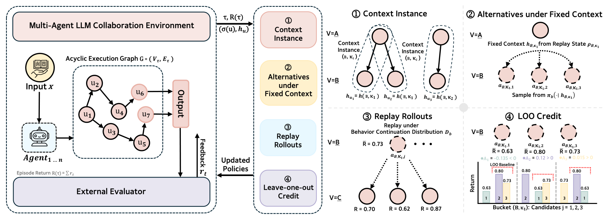
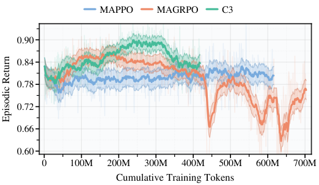
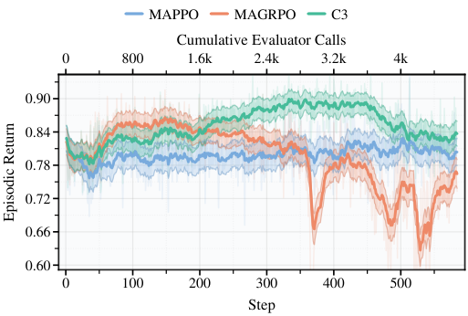

<div align="center">
  
  <p><strong>Contextual Counterfactual Credit Assignment</strong></p>
  <p>
    <a href="https://eit-east-lab.github.io/C3/"></a>
    <a href="https://arxiv.org/abs/2603.06859"></a>
    <a href="https://arxiv.org/pdf/2603.06859"></a>
    <a href="docs/20_implementation_audit.md"></a>
    <a href="docs/50_release_policy.md"></a>
    <a href=".github/workflows/ci-cpu.yml"></a>
    <a href=".github/workflows/ci-cpu.yml"></a>
    <a href="LICENSE"></a>
    <a href="pyproject.toml"></a>
  </p>
  <p>
    <a href="https://eit-east-lab.github.io/C3/">Project Page</a> |
    <a href="https://arxiv.org/abs/2603.06859">arXiv</a> |
    <a href="https://arxiv.org/pdf/2603.06859">PDF</a> |
    <a href="docs/00_getting_started.md">Getting Started</a> |
    <a href="docs/10_code_map.md">Code Map</a> |
    <a href="docs/21_implementation_checklist.md">Implementation Checklist</a> |
    <a href="docs/51_release_checklist.md">Release Checklist</a> |
    <a href="CHANGELOG.md">Changelog</a>
  </p>
</div>

Reference implementation for the paper **Contextual Counterfactual Credit Assignment for Multi-Agent Reinforcement Learning in LLM Collaboration**.

Paper status: now available on arXiv as [2603.06859](https://arxiv.org/abs/2603.06859). The companion project page is available at [eit-east-lab.github.io/C3](https://eit-east-lab.github.io/C3/), and the official PDF is available [here](https://arxiv.org/pdf/2603.06859).

Repository version 0.2.2. See [CHANGELOG.md](CHANGELOG.md) for what changed and why.

## TL;DR

Terminal-only feedback in multi-agent LLM collaboration diffuses credit across an entire trajectory. **C3** freezes transcript-derived context and estimates local causal credit with fixed-context replay plus a leave-one-out baseline, outperforming MAPPO and MAGRPO while improving fidelity, variance, and inter-agent influence under matched budgets.

<p align="center">
  <a href="#core-mechanism">Mechanism</a> |
  <a href="#key-results">Results</a> |
  <a href="#cpu-quickstart">CPU Quickstart</a> |
  <a href="#gpu-path">GPU Path</a> |
  <a href="#main-workflows">Workflows</a> |
  <a href="#audit-and-release-gate">Release Gate</a>
</p>

## Core Mechanism

<div align="center">
  
</div>

**Figure 1**: C3 mechanism overview. Protocol-level replay, fixed-context alternatives, and leave-one-out credit assignment.

## Key Results

<div align="center">
  
  &nbsp;
  
</div>

**Main paper results**: Sample-efficiency and performance trajectories against baseline methods (e.g., MAPPO, MAGRPO). C3 reaches superior performance given matched training token budgets.

## Repository Purpose

`C3` is a paper-aligned research codebase designed to support:

- **Protocol Reproduction**: Executing the multi-agent task protocols described in the paper.
- **Experiment Execution**: Running full training sweeps, evaluation-only probes, and performance analyses.
- **Implementation Audit**: Providing a transparent mapping from theoretical mechanisms to executable code.
- **Extension and Testing**: Modifying or testing the framework without relying on private paths or bundled artifacts.

## Release Scope

To maintain a clean public-release surface, this repository does **not** distribute:
- Prepared datasets
- Trained model checkpoints
- Cached model weights
- Generated run-time artifacts (e.g., run logs, checkpoints, reports, and experiment outputs)

Corresponding local directories (`data/`, `artifacts/`, `ckpt/`, `runs/`, `wandb/`, `models/`) are treated as local working outputs and remain empty or absent in the public release. For details, see the [Release Policy](docs/50_release_policy.md).

## Repository Structure

- [c3/](c3/): Core C3 implementation, including multi-agent protocol handling, environments, credit assignment logic, and analysis tools.
- [openrlhf/](openrlhf/): Vendored upstream RLHF training stack, augmented with C3-specific integration points.
- [configs/](configs/): Configurations for tasks, roles, analyses, execution registries, and data manifests.
- [requirements/](requirements/): Lock files for the CPU tier, the current GPU tier, and the paper environment.
- [scripts/](scripts/): Entrypoints, numbered in the order a new user runs them.
- [docs/](docs/): Documentation, numbered in reading order.
- [tests/](tests/): Unit tests, release-surface contract tests, the CPU mechanism test, and tiny fixtures.
- [project-page/](project-page/): Static companion site for the paper, deployed via GitHub Pages.

The `scripts/` numbers are the workflow:

| Directory | Stage |
|---|---|
| [scripts/10_data/](scripts/10_data/) | Download and pin the datasets |
| [scripts/20_models/](scripts/20_models/) | Pre-download the base models |
| [scripts/30_smoke/](scripts/30_smoke/) | Fast wiring checks and the reproduction preflight |
| [scripts/40_train/](scripts/40_train/) | The paper training matrix (GPU) |
| [scripts/50_eval/](scripts/50_eval/) | The paper main-results sweep (GPU) |
| [scripts/60_analysis/](scripts/60_analysis/) | Analysis figures |
| [scripts/70_rebuild/](scripts/70_rebuild/) | Reliability and ablation cells, and the start-accuracy probe (GPU) |
| [scripts/90_audit/](scripts/90_audit/) | Release audit and the local release gate |
| [scripts/_lib/](scripts/_lib/) | Shared shell helpers, sourced rather than run |

## Quick Navigation

- **Project Page**: [C3 Paper Page](https://eit-east-lab.github.io/C3/)
- **Paper**: [arXiv Abstract](https://arxiv.org/abs/2603.06859)
- **PDF**: [arXiv PDF](https://arxiv.org/pdf/2603.06859)
- **New User**: [Getting Started Guide](docs/00_getting_started.md)
- **Code Layout**: [Code Map](docs/10_code_map.md)
- **Paper-to-Code Mapping**: [Implementation Audit](docs/20_implementation_audit.md)
- **Development Invariants**: [Implementation Checklist](docs/21_implementation_checklist.md)
- **Data Provenance**: [Data Sources](docs/30_data_sources.md)
- **How Models Are Measured**: [Evaluation Protocol](docs/32_evaluation_protocol.md)
- **Release Verification**: [Release Checklist](docs/51_release_checklist.md)
- **Upstream Lineage**: [Upstream Provenance](docs/40_upstream.md)
- **Release Notes**: [Changelog](CHANGELOG.md)
- **Network Mirrors**: [docs/31_network_mirrors.md](docs/31_network_mirrors.md)

## System Requirements

The repository installs in two tiers. Pick the one that matches what you want to do.

| | CPU tier | GPU tier |
|---|---|---|
| Hardware | Any x86_64 machine, no GPU | NVIDIA GPUs |
| CUDA runtime | not used | CUDA 13 with [requirements/gpu.lock.txt](requirements/gpu.lock.txt) (torch 2.13.0, which pulls the CUDA 13 runtime wheels), CUDA 12.8 with [requirements/gpu-paper.lock.txt](requirements/gpu-paper.lock.txt) (torch 2.9.0+cu128, the paper environment) |
| Python | 3.11 | 3.11 |
| What it enables | Unit tests, dataset preparation and verification, smoke tests, analysis and plotting tooling on stored run artifacts (loading a critic checkpoint needs the GPU tier with flash-attn), the release gate | Everything in the CPU tier, plus training and full paper reproduction |
| Lock file | [requirements/cpu.lock.txt](requirements/cpu.lock.txt) | [requirements/gpu.lock.txt](requirements/gpu.lock.txt) |

The environment that produced the paper's numbers is preserved verbatim as
[requirements/gpu-paper.lock.txt](requirements/gpu-paper.lock.txt). Use it to
reproduce the published results against the exact stack that produced them.

## Installation

### CPU tier

```bash
python -m pip install -U pip
python -m pip install -r requirements/cpu.lock.txt
python -m pip install -e . --no-deps
python -m pip check
```

The lock file pins the CPU build of PyTorch, which is published on PyTorch's own
index. The required `--extra-index-url` line is inside the lock file, so no extra
flag is needed. To resolve current versions instead of using the lock, run
`python -m pip install -e ".[cpu,test]"`. On Linux that command resolves PyPI's
default PyTorch wheel, which is the CUDA build; add
`--extra-index-url https://download.pytorch.org/whl/cpu` to stay CPU-only.

### GPU tier

```bash
python -m pip install -U pip
python -m pip install -r requirements/gpu.lock.txt
python -m pip install -e . --no-deps
python -m pip check
```

FlashAttention has no wheels: it builds from source and needs a CUDA toolchain
(`nvcc`). It is therefore absent from [requirements/cpu.lock.txt](requirements/cpu.lock.txt)
and [requirements/gpu.lock.txt](requirements/gpu.lock.txt), and recorded in
[requirements/gpu-paper.lock.txt](requirements/gpu-paper.lock.txt)
(`flash_attn==2.8.3`) because the paper environment had it installed.

The plain consequence: importing the training entry point and running the smoke
test do not need flash-attn, but a training run as scripted does, because the
CLI's `--attn_implementation` defaults to `flash_attention_2`
([openrlhf/cli/train_ppo_ray_tooling.py](openrlhf/cli/train_ppo_ray_tooling.py))
and [scripts/40_train/paper_train.sh](scripts/40_train/paper_train.sh) does not
override it. The analysis subcommand that loads a critic checkpoint also requests
`flash_attention_2` and needs a GPU with flash-attn
([c3/analysis/analysis.py](c3/analysis/analysis.py)); the rest of the analysis
and plotting tooling runs on stored run artifacts and stays in the CPU tier.
Install flash-attn on the GPU machine before running `scripts/40_train`. Ring
attention (the sequence-packing path across ranks) needs both flash-attn and
ring-flash-attn, and raises a `RuntimeError` naming the command below at the
point of use.

The command installs both, and is:

```bash
python -m pip install -e ".[flash]" --no-build-isolation
```

Reproduction scripts export the repository root on `PYTHONPATH` themselves, through
[scripts/_lib/common_env.sh](scripts/_lib/common_env.sh).

## CPU Quickstart

This runs end to end on a laptop: no GPU, no checkpoints, no model weights.

```bash
# 1. Install the CPU tier
python -m pip install -r requirements/cpu.lock.txt
python -m pip install -e . --no-deps

# 2. Check the installation
pytest -q tests

# 3. Run the fixture smoke test (tiny bundled data, no downloads)
bash scripts/30_smoke/smoke.sh --task tests/fixtures/tasks/mini_math.yaml --limit 1 --print_example 0

# 4. Prepare the real datasets and verify them against the manifest
bash scripts/10_data/prepare_all.sh --out_dir data --strict 1

# 5. Run the real-data smoke test
bash scripts/30_smoke/smoke.sh --task math --limit 1 --print_example 0
```

On a CPU machine the smoke test import-checks the `c3` entrypoints only.
`--tier gpu` additionally import-checks the training CLI, which needs the GPU tier;
`--tier auto` (the default) picks `gpu` only when torch reports a usable CUDA
device and the training stack (`vllm` and `ray`) is importable, so a GPU machine
with only the CPU tier installed still gets `cpu`. The resolved tier and the
reason are printed.

## GPU Path

With the GPU tier installed, the paper workflows are:

```bash
bash scripts/40_train/paper_train.sh                       # training matrix
bash scripts/50_eval/paper_main_results.sh sweep ...       # evaluation matrix
bash scripts/60_analysis/paper_analysis_figs.sh fig2 ...   # analysis figures
```

Each one is spelled out under [Main Workflows](#main-workflows).

## Network Mirrors

Every download goes to its official source by default, and no mirror is
hard-coded anywhere in this repository. If your network cannot reach PyPI,
Hugging Face or GitHub directly, opt into a mirror through `HF_ENDPOINT`,
`GITHUB_MIRROR_PREFIX`, `PIP_INDEX_URL` or `PIP_EXTRA_INDEX_URL`; see
[Network Mirrors](docs/31_network_mirrors.md). Data integrity does not depend on
trusting a mirror: `--strict 1` verifies every prepared file against the SHA256
pins in `configs/data_manifest.yaml`.

## Data Preparation

Prepared datasets are generated locally from strictly pinned upstream sources. They are not bundled with the codebase.

```bash
bash scripts/10_data/prepare_all.sh --out_dir data
```

The authoritative source of truth for all data derivations is [configs/data_manifest.yaml](configs/data_manifest.yaml). See [Data Sources](docs/30_data_sources.md) and [Third-Party Notices](THIRD_PARTY_NOTICES.md) for provenance details.

## Model Preparation

While Transformers/vLLM will automatically download weights on first use, we provide a dedicated utility to pre-download and cache all required HuggingFace base models. This is highly recommended for reproducibility, offline clusters, or avoiding concurrent download races:

```bash
# Log in to Hugging Face (required for gated models like Qwen)
hf auth login

# List what the registry resolves to, without downloading anything
bash scripts/20_models/download_models.sh --dry_run 1

# Pre-download all base models referenced in the results registry
bash scripts/20_models/download_models.sh \
  --registry configs/main_results_registry.yaml \
  --out_dir models
```

## Main Workflows

### Smoke Test
Fast end-to-end wiring check to verify environment and protocol integrity:
```bash
bash scripts/30_smoke/smoke.sh
```

### SFT-only Main Results Sweep
Run the evaluation matrix exclusively for the SFT baseline:
```bash
bash scripts/50_eval/paper_main_results.sh sweep \
  --registry configs/main_results_registry.yaml \
  --only_methods SFT
```

### Full Paper Training Matrix
Execute the complete set of model training runs:
```bash
export PRETRAIN='Qwen/Qwen2.5-3B-Instruct'
bash scripts/40_train/paper_train.sh
```

### Full Main Results Sweep
Run the full paper evaluation matrix across all methods:
```bash
bash scripts/50_eval/paper_main_results.sh sweep \
  --registry configs/main_results_registry.yaml
```

### Evaluation of Record

The numbers of the main table come from one evaluation per trained model, run
after training by [scripts/70_rebuild/final_eval.py](scripts/70_rebuild/final_eval.py).
The estimator is avg@k, k is fixed per suite by a sampling-noise calculation, and
one evaluation run has exactly one k, so the driver groups the suites by their k
and runs one evaluation per group. Which suites, with what decoding, where k
comes from and what the evaluation record holds are all in
[Evaluation Protocol](docs/32_evaluation_protocol.md).

```bash
# Print the two commands and stop. Needs neither a GPU nor a model.
python scripts/70_rebuild/final_eval.py --policy /models/Qwen3-4B-Instruct-2507 --dry-run

# Evaluate one finished training run and write its record.
python scripts/70_rebuild/final_eval.py \
  --policy ckpt/_runs/paper_C3_math_seed0/final_hf \
  --run_id paper_C3_math_seed0 \
  --out /abs/path/final_eval_record.json
```

The evaluation that runs during training is a different thing: every ten percent
of the run, on the five main-table suites at four samples per problem, and it
feeds the monitoring curve only.

### Paper Analyses
Generate analysis figures directly from local run directories:
```bash
bash scripts/60_analysis/paper_analysis_figs.sh fig2 \
  --suite math \
  --run_c3 ckpt/_runs/<C3_run_dir> \
  --run_mappo ckpt/_runs/<MAPPO_run_dir> \
  --run_magrpo ckpt/_runs/<MAGRPO_run_dir> \
  --run_sft ckpt/_runs/_sft_main_results/<SFT_dir> \
  --mappo_critic_ckpt <PATH_TO_MAPPO_CRITIC>
```

### Reliability and Ablation Drivers

The drivers under [scripts/70_rebuild/](scripts/70_rebuild/) measure the credit
estimator itself on a frozen policy. They are not on the training path and they
change nothing in it. Each one takes `--dry-run`, which prints the commands it
would run and the cell count without a GPU or a model, so you can read the full
sweep before spending anything on it.

- [scripts/70_rebuild/e1_cells.py](scripts/70_rebuild/e1_cells.py): emit, and optionally run, the bucket-generation cells of the E1 depth study.
- [scripts/70_rebuild/e3a_cells.py](scripts/70_rebuild/e3a_cells.py): emit, and optionally run, the bucket-generation cells of the E3a bias map.
- [scripts/70_rebuild/eval_probe.py](scripts/70_rebuild/eval_probe.py): measure the start accuracy of a frozen policy on the candidate benchmarks.

```bash
# Print the 60 commands of the full E1 sweep and the cell count.
python scripts/70_rebuild/e1_cells.py --model_root /models --dry-run

# Run one E1 cell.
python scripts/70_rebuild/e1_cells.py --model_root /models \
    --results_root /abs/path/20_data/results --only a3/4b/3

# Print the two E3a commands and the cell count.
python scripts/70_rebuild/e3a_cells.py --model_root /models --dry-run

# Run one E3a cell.
python scripts/70_rebuild/e3a_cells.py --model_root /models \
    --results_root /abs/path/20_data/results --only empty

# Print the two start-accuracy probe commands and stop.
python scripts/70_rebuild/eval_probe.py --policy /models/Qwen3-4B-Instruct-2507 --dry-run

# Run both decodings of the probe and write the summary.
python scripts/70_rebuild/eval_probe.py --policy /models/Qwen3-4B-Instruct-2507 \
    --out /abs/path/probe_summary.json
```

The probe reads the suites declared in
[configs/tasks/math_eval_probe.yaml](configs/tasks/math_eval_probe.yaml). They
are evaluation only; the main task evaluates on four of them since the
evaluation protocol of 2026-09-15; nothing trains on them. The default
preparation run writes them, so no extra flag is needed; see
[Data Sources](docs/30_data_sources.md).

## Implementation Note

The paper's credit assignment lives in [c3/credit/counterfactual/](c3/credit/counterfactual/) and [openrlhf/trainer/ppo_utils/experience_maker.py](openrlhf/trainer/ppo_utils/experience_maker.py); see the [Implementation Audit](docs/20_implementation_audit.md) for the full paper-to-code mapping.

## Audit and Release Gate

Before making any public release, execute the pre-release checks:

```bash
bash scripts/90_audit/pre_release.sh
```

To run the complete local release gate (including syntax checks and unit tests):
```bash
bash scripts/90_audit/release_gate.sh
```

For a single-command preflight reproduction check:
```bash
bash scripts/30_smoke/preflight_repro.sh --task math
```

These gating scripts verify:
- Absence of hard-coded private paths
- Absence of obvious leaked secrets
- Absence of bundled datasets or generated release-surface artifacts
- English prose with no em or en dashes, and no CJK outside the functional allowlist
- Bash scripting syntax sanity
- Python compilation and test suite sanity
- That the gate itself leaves no artifacts in the working tree

Both scripts run on a CPU machine with the CPU tier installed. The same two
stages run in CI on every push and pull request; see
[.github/workflows/ci-cpu.yml](.github/workflows/ci-cpu.yml).

## Governance

This repository includes standard open-source policy files:

- [CONTRIBUTING.md](CONTRIBUTING.md)
- [CODE_OF_CONDUCT.md](CODE_OF_CONDUCT.md)
- [SECURITY.md](SECURITY.md)
- [.github/ISSUE_TEMPLATE](.github/ISSUE_TEMPLATE)
- [.github/pull_request_template.md](.github/pull_request_template.md)

## License and Attribution

- Code license: [Apache-2.0](LICENSE)
- Citation metadata: [CITATION.cff](CITATION.cff)
- Third-party notices: [THIRD_PARTY_NOTICES.md](THIRD_PARTY_NOTICES.md)
- Upstream provenance: [docs/40_upstream.md](docs/40_upstream.md)

## Acknowledgements

We deeply appreciate the open-source community for their foundational work. In particular, we would like to acknowledge:

- **[OpenRLHF](https://github.com/OpenRLHF/OpenRLHF)**: Our RL infrastructure is built upon the OpenRLHF framework. We are grateful to the OpenRLHF team for providing an easy-to-use, scalable, and high-performance agentic RL foundation based on Ray and vLLM.

## Citation

If you find this repository or paper useful for your research, please cite:

```bibtex
@misc{chen2026contextualcounterfactualcreditassignment,
  title={Contextual Counterfactual Credit Assignment for Multi-Agent Reinforcement Learning in LLM Collaboration},
  author={Yanjun Chen and Yirong Sun and Hanlin Wang and Xinming Zhang and Xiaoyu Shen and Wenjie Li and Wei Zhang},
  year={2026},
  eprint={2603.06859},
  archivePrefix={arXiv},
  primaryClass={cs.LG},
  url={https://arxiv.org/abs/2603.06859}
}
```
