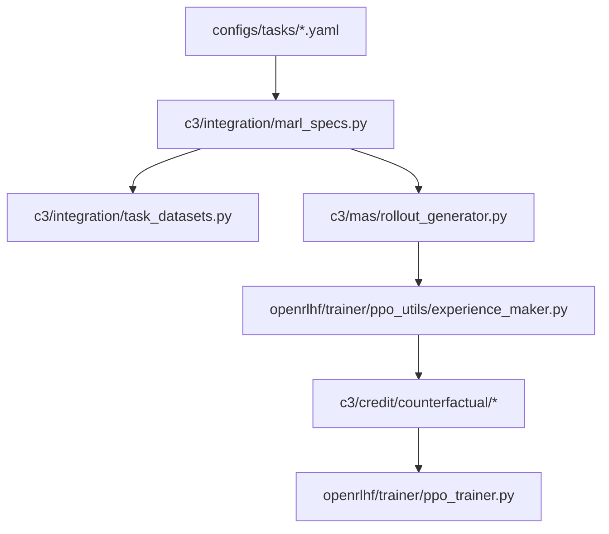

# Code Map

This document is a quick navigation guide to the repository. It is intentionally shorter than [20_implementation_audit.md](20_implementation_audit.md): the goal here is to help readers find the right entrypoint quickly.

## Top-level layout

- `c3/`: project-native code
- `openrlhf/`: vendored upstream training stack with C3 integrations
- `configs/`: task, role, registry, analysis, and data-manifest config
- `requirements/`: lock files for the CPU tier, the GPU tier, and the paper environment
- `scripts/`: entrypoints, numbered in the order a new user runs them
- `docs/`: documentation, numbered in reading order
- `tests/`: unit tests, release-surface contract tests, the CPU mechanism test, and tiny fixtures

## The numbered stages

| Directory | Stage | Needs a GPU |
|---|---|---|
| [scripts/10_data/](../scripts/10_data) | dataset download, canonicalization, SHA256 verification | no |
| [scripts/20_models/](../scripts/20_models) | base model pre-download | no |
| [scripts/30_smoke/](../scripts/30_smoke) | wiring smoke test and reproduction preflight | no |
| [scripts/40_train/](../scripts/40_train) | the paper training matrix | yes |
| [scripts/50_eval/](../scripts/50_eval) | the paper main-results sweep | yes |
| [scripts/60_analysis/](../scripts/60_analysis) | analysis figures from local run directories | no |
| [scripts/90_audit/](../scripts/90_audit) | release audit and local release gate | no |
| [scripts/_lib/](../scripts/_lib) | shared shell helpers, sourced rather than executed | no |

## Where to look first

### I want to understand the paper path

1. [configs/tasks/math.yaml](../configs/tasks/math.yaml)
2. [configs/tasks/code.yaml](../configs/tasks/code.yaml)
3. [c3/integration/marl_specs.py](../c3/integration/marl_specs.py)
4. [c3/integration/task_datasets.py](../c3/integration/task_datasets.py)
5. [c3/mas/rollout_generator.py](../c3/mas/rollout_generator.py)
6. [openrlhf/trainer/ppo_utils/experience_maker.py](../openrlhf/trainer/ppo_utils/experience_maker.py)
7. [c3/credit/counterfactual/](../c3/credit/counterfactual)

### I want to run the repository

- fast smoke: [scripts/30_smoke/smoke.sh](../scripts/30_smoke/smoke.sh)
- data prep: [scripts/10_data/prepare_all.sh](../scripts/10_data/prepare_all.sh)
- model prep: [scripts/20_models/download_models.sh](../scripts/20_models/download_models.sh)
- training matrix: [scripts/40_train/paper_train.sh](../scripts/40_train/paper_train.sh)
- main-results sweep: [scripts/50_eval/paper_main_results.sh](../scripts/50_eval/paper_main_results.sh)
- analysis figures: [scripts/60_analysis/paper_analysis_figs.sh](../scripts/60_analysis/paper_analysis_figs.sh)
- release audit: [scripts/90_audit/pre_release.sh](../scripts/90_audit/pre_release.sh)
- release gate: [scripts/90_audit/release_gate.sh](../scripts/90_audit/release_gate.sh)

### I want to understand the environments

- math reward entry: [c3/envs/math/reward.py](../c3/envs/math/reward.py)
- code reward entry: [c3/envs/code/reward.py](../c3/envs/code/reward.py)
- code executor: [c3/envs/code/executor.py](../c3/envs/code/executor.py)
- environment dispatch: [c3/envs/registry.py](../c3/envs/registry.py)

### I want to understand the baselines

- MAPPO baseline: [c3/algorithms/mappo.py](../c3/algorithms/mappo.py)
- MAGRPO baseline: [c3/algorithms/magrpo.py](../c3/algorithms/magrpo.py)
- group-baseline fallback registered as "c3": [c3/algorithms/group_baseline.py](../c3/algorithms/group_baseline.py)
- algorithm naming and normalization: [c3/algorithms/registry.py](../c3/algorithms/registry.py)

### I want to understand evaluation and paper tables

- main-results aggregation: [c3/tools/main_results.py](../c3/tools/main_results.py)
- analysis aggregation: [c3/tools/analysis_results.py](../c3/tools/analysis_results.py)
- plotting: [c3/tools/plot_paper_figures.py](../c3/tools/plot_paper_figures.py)
- analysis CLI: [c3/analysis/analysis.py](../c3/analysis/analysis.py)

## Core path vs fallback path

### Core C3 path

### Important note

The paper-facing C3 implementation is the node-level credit path:

- [openrlhf/trainer/ppo_utils/experience_maker.py](../openrlhf/trainer/ppo_utils/experience_maker.py)
- [c3/credit/counterfactual/provider.py](../c3/credit/counterfactual/provider.py)
- [c3/credit/counterfactual/materialize.py](../c3/credit/counterfactual/materialize.py)

[c3/algorithms/group_baseline.py](../c3/algorithms/group_baseline.py) is the
token-level calculator that the algorithm registry resolves for the name `"c3"`.
It computes MAGRPO-style group-baseline advantages and exists so that training
stays runnable when the counterfactual credit path is unavailable, for example
when K is 1 or the critic scorer is missing. It is not the paper's method. Until
release 0.2.0 that module was called `c3/algorithms/c3.py`, which is exactly the
confusion the rename removes.

## Deprecated import paths

These five shims re-export their replacements and raise a `DeprecationWarning`:

| Old import | New import |
|---|---|
| `c3.credit.c3` | `c3.credit.counterfactual` |
| `c3.algorithms.c3` | `c3.algorithms.group_baseline` |
| `c3.text_sanitize` | `c3.utils.text_sanitize` |
| `c3.tools.c3_env_smoke` | `c3.tools.env_smoke` |
| `c3.analysis.c3_analysis` | `c3.analysis.analysis` |

The last two also keep `python -m <old path>` working.

## Configuration single sources of truth

- dataset provenance and SHA pins: [configs/data_manifest.yaml](../configs/data_manifest.yaml)
- main-results registry: [configs/main_results_registry.yaml](../configs/main_results_registry.yaml)
- analysis defaults: [configs/analysis.yaml](../configs/analysis.yaml)
- task configs: [configs/tasks/](../configs/tasks)
- role configs: [configs/roles/](../configs/roles)

## Related docs

- paper-to-code mapping: [20_implementation_audit.md](20_implementation_audit.md)
- release surface rules: [50_release_policy.md](50_release_policy.md)
- data provenance and strict verification: [30_data_sources.md](30_data_sources.md)
- network mirrors: [31_network_mirrors.md](31_network_mirrors.md)
- upstream provenance: [40_upstream.md](40_upstream.md)
