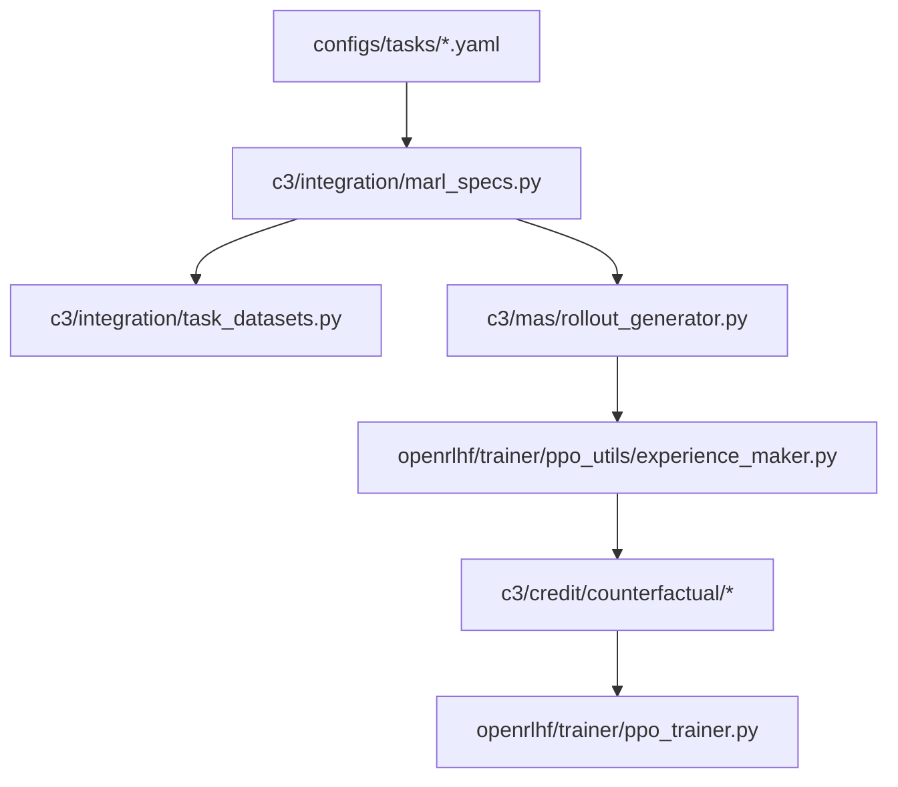

# Code Map

This document is a quick navigation guide to the repository. It is intentionally shorter than [20_implementation_audit.md](20_implementation_audit.md): the goal here is to help readers find the right entrypoint quickly.

## Top-level layout

- `c3/`: project-native code
- `openrlhf/`: vendored upstream training stack with C3 integrations
- `configs/`: task, role, registry, analysis, and data-manifest config
- `requirements/`: lock files for the CPU tier, the GPU tier, and the paper environment
- `scripts/`: entrypoints, numbered in the order a new user runs them
- `docs/`: documentation, numbered in reading order
- `tests/`: unit tests, release-surface contract tests, the CPU mechanism test, and tiny fixtures

## The numbered stages

| Directory | Stage | Needs a GPU |
|---|---|---|
| [scripts/10_data/](../scripts/10_data) | dataset download, canonicalization, SHA256 verification | no |
| [scripts/20_models/](../scripts/20_models) | base model pre-download | no |
| [scripts/30_smoke/](../scripts/30_smoke) | wiring smoke test and reproduction preflight | no |
| [scripts/40_train/](../scripts/40_train) | the paper training matrix | yes |
| [scripts/50_eval/](../scripts/50_eval) | the paper main-results sweep | yes |
| [scripts/60_analysis/](../scripts/60_analysis) | analysis figures from local run directories | no |
| [scripts/70_rebuild/](../scripts/70_rebuild) | bucket-generation cells of the E1 depth study and the E3a bias map, and the start-accuracy probe | yes |
| [scripts/90_audit/](../scripts/90_audit) | release audit and local release gate | no |
| [scripts/_lib/](../scripts/_lib) | shared shell helpers, sourced rather than executed | no |

## Where to look first

### I want to understand the paper path

1. [configs/tasks/math.yaml](../configs/tasks/math.yaml)
2. [configs/tasks/code.yaml](../configs/tasks/code.yaml)
3. [c3/integration/marl_specs.py](../c3/integration/marl_specs.py)
4. [c3/integration/task_datasets.py](../c3/integration/task_datasets.py)
5. [c3/mas/rollout_generator.py](../c3/mas/rollout_generator.py)
6. [openrlhf/trainer/ppo_utils/experience_maker.py](../openrlhf/trainer/ppo_utils/experience_maker.py)
7. [c3/credit/counterfactual/](../c3/credit/counterfactual)

### I want to run the repository

- fast smoke: [scripts/30_smoke/smoke.sh](../scripts/30_smoke/smoke.sh)
- data prep: [scripts/10_data/prepare_all.sh](../scripts/10_data/prepare_all.sh)
- data contamination gate: [scripts/10_data/check_overlap.py](../scripts/10_data/check_overlap.py), which fails when an evaluation problem also occurs in a training file
- model prep: [scripts/20_models/download_models.sh](../scripts/20_models/download_models.sh)
- training matrix: [scripts/40_train/paper_train.sh](../scripts/40_train/paper_train.sh)
- main-results sweep: [scripts/50_eval/paper_main_results.sh](../scripts/50_eval/paper_main_results.sh)
- analysis figures: [scripts/60_analysis/paper_analysis_figs.sh](../scripts/60_analysis/paper_analysis_figs.sh)
- release audit: [scripts/90_audit/pre_release.sh](../scripts/90_audit/pre_release.sh)
- release gate: [scripts/90_audit/release_gate.sh](../scripts/90_audit/release_gate.sh)

### I want to understand the environments

- math reward entry: [c3/envs/math/reward.py](../c3/envs/math/reward.py)
- code reward entry: [c3/envs/code/reward.py](../c3/envs/code/reward.py)
- code executor: [c3/envs/code/executor.py](../c3/envs/code/executor.py)
- environment dispatch: [c3/envs/registry.py](../c3/envs/registry.py)

### I want to understand the baselines

- MAPPO baseline: [c3/algorithms/mappo.py](../c3/algorithms/mappo.py)
- MAGRPO baseline: [c3/algorithms/magrpo.py](../c3/algorithms/magrpo.py)
- group-baseline fallback registered as "c3": [c3/algorithms/group_baseline.py](../c3/algorithms/group_baseline.py)
- algorithm naming and normalization: [c3/algorithms/registry.py](../c3/algorithms/registry.py)

### I want to understand evaluation and paper tables

- main-results aggregation: [c3/tools/main_results.py](../c3/tools/main_results.py)
- analysis aggregation: [c3/tools/analysis_results.py](../c3/tools/analysis_results.py)
- plotting: [c3/tools/plot_paper_figures.py](../c3/tools/plot_paper_figures.py)
- analysis CLI: [c3/analysis/analysis.py](../c3/analysis/analysis.py)

## Core path vs fallback path

### Core C3 path

### Important note

The paper-facing C3 implementation is the node-level credit path:

- [openrlhf/trainer/ppo_utils/experience_maker.py](../openrlhf/trainer/ppo_utils/experience_maker.py)
- [c3/credit/counterfactual/provider.py](../c3/credit/counterfactual/provider.py)
- [c3/credit/counterfactual/materialize.py](../c3/credit/counterfactual/materialize.py)

[c3/algorithms/group_baseline.py](../c3/algorithms/group_baseline.py) is the
token-level calculator that the algorithm registry resolves for the name `"c3"`.
It computes MAGRPO-style group-baseline advantages and exists so that training
stays runnable when the counterfactual credit path is unavailable, for example
when K is 1 or the critic scorer is missing. It is not the paper's method. Until
release 0.2.0 that module was called `c3/algorithms/c3.py`, which is exactly the
confusion the rename removes.

## Rebuild study: reliability and ablation

Added after release 0.2.0. These files measure the credit estimator itself on a
frozen policy; none of them is on the training path, and none of them changes
it. Every entry below states what the file's own module docstring or header
comment says it does.

### Drivers

| File | What it does | Needs a GPU |
|---|---|---|
| [scripts/70_rebuild/e1_cells.py](../scripts/70_rebuild/e1_cells.py) | Emit, and optionally run, the bucket-generation cells of the E1 depth study | yes, except `--dry-run` |
| [scripts/70_rebuild/e3a_cells.py](../scripts/70_rebuild/e3a_cells.py) | Emit, and optionally run, the bucket-generation cells of the E3a bias map | yes, except `--dry-run` |
| [scripts/70_rebuild/eval_probe.py](../scripts/70_rebuild/eval_probe.py) | Measure the start accuracy of a frozen policy on the candidate benchmarks | yes, except `--dry-run` and `--summarize_only` |

### Replay and analysis modules

| Module | What it does |
|---|---|
| [c3/analysis/replay_batched.py](../c3/analysis/replay_batched.py) | Cross bucket batched counterfactual replay: it keeps the semantics of `ReplayRunner.run_bucket` and only changes when the calls are issued, handing every bucket that needs a generation at the same stage to the policy in one `sample_many` call |
| [c3/analysis/rebuild/\_\_init\_\_.py](../c3/analysis/rebuild/__init__.py) | Empty package marker; the file has no docstring |
| [c3/analysis/rebuild/splithalf.py](../c3/analysis/rebuild/splithalf.py) | Split-half reliability of within-group credit, per group and per cell |
| [c3/analysis/rebuild/duplicates.py](../c3/analysis/rebuild/duplicates.py) | Duplicate alternatives inside a group (E1c: the duplicate-rate monitor) |
| [c3/analysis/rebuild/noise_law.py](../c3/analysis/rebuild/noise_law.py) | E1b: measured against predicted estimator noise of the leave-one-out advantage |
| [c3/analysis/rebuild/influence.py](../c3/analysis/rebuild/influence.py) | Answer-level plug-in mutual information `I(J; Y \| h)`, the influence estimator frozen in the preregistration for the rebuild experiments (E3a, E5) |
| [c3/analysis/rebuild/bias_map.py](../c3/analysis/rebuild/bias_map.py) | E3a: the ablation bias map, decision point by decision point |
| [c3/analysis/rebuild/coupling.py](../c3/analysis/rebuild/coupling.py) | E5: the paired contrast between two policies, with the estimators frozen |
| [c3/analysis/rebuild/summary.py](../c3/analysis/rebuild/summary.py) | The single writer of the `summary.json` defined by results contract section 3.4 |
| [c3/analysis/rebuild/aggregate_e1.py](../c3/analysis/rebuild/aggregate_e1.py) | E1 aggregation: scan the reliability cells, write the E1 `summary.json` |
| [c3/analysis/rebuild/aggregate_e1b.py](../c3/analysis/rebuild/aggregate_e1b.py) | E1b aggregation: the noise-law grid |
| [c3/analysis/rebuild/aggregate_e1c_temp.py](../c3/analysis/rebuild/aggregate_e1c_temp.py) | E1c aggregation for the temperature sweep and the alert-band subsets |
| [c3/analysis/rebuild/aggregate_e3a.py](../c3/analysis/rebuild/aggregate_e3a.py) | Command line aggregation for E3a, the ablation bias map |
| [c3/analysis/rebuild/aggregate_e5.py](../c3/analysis/rebuild/aggregate_e5.py) | Command line aggregation for E5, the paired policy contrast |

### Workflow configs

The task files declare the same data as [configs/tasks/math.yaml](../configs/tasks/math.yaml)
unless the row says otherwise. The role graph column is read off the role file's
`role` and `depends_on` fields.

| Task file | Role file | Role graph |
|---|---|---|
| [configs/tasks/math_a3.yaml](../configs/tasks/math_a3.yaml), three-agent workflow | [roles_trio.json](../configs/roles/math/roles_trio.json) | reasoner, actor, verifier |
| [configs/tasks/math_mt4.yaml](../configs/tasks/math_mt4.yaml), four-turn workflow | [roles_mt4.json](../configs/roles/math/roles_mt4.json) | reasoner_1, actor_1, reasoner_2, actor_2 |
| [configs/tasks/math_branch.yaml](../configs/tasks/math_branch.yaml), branching workflow | [roles_branch.json](../configs/roles/math/roles_branch.json) | planner, then solver_a and solver_b in parallel, then integrator |
| [configs/tasks/math_c5.yaml](../configs/tasks/math_c5.yaml), five-agent chain | [roles_c5.json](../configs/roles/math/roles_c5.json) | planner, solver, critic, reviser, verifier |
| [configs/tasks/math_c10.yaml](../configs/tasks/math_c10.yaml), ten-agent chain | [roles_c10.json](../configs/roles/math/roles_c10.json) | reader, planner, decomposer, solver_a, solver_b, integrator, critic, reviser, checker, verifier |
| [configs/tasks/math_screen.yaml](../configs/tasks/math_screen.yaml), E1 screening pass over the whole MATH test pool | [roles_duo.json](../configs/roles/math/roles_duo.json) | reasoner, actor |
| [configs/tasks/math_eval_probe.yaml](../configs/tasks/math_eval_probe.yaml), start-accuracy probe over the candidate benchmarks, evaluation only | [roles_duo.json](../configs/roles/math/roles_duo.json) | reasoner, actor |

### Tests added with these files

| Test file | What it pins |
|---|---|
| [tests/test_bucket_guard.py](../tests/test_bucket_guard.py) | The context-key collision guard of the bucket validator |
| [tests/test_chat_template_thinking.py](../tests/test_chat_template_thinking.py) | Thinking stays off on hybrid-thinking chat templates |
| [tests/test_data_overlap.py](../tests/test_data_overlap.py) | The data contamination gate and the split rules it depends on |
| [tests/test_prepare_code_subtract.py](../tests/test_prepare_code_subtract.py) | MBPP-train is written minus the problems that also occur in MBPP-test |
| [tests/test_prepare_math_gate.py](../tests/test_prepare_math_gate.py) | The data-prep write door refuses rows without an answer, and CMATH's `golden` column is read |
| [tests/test_rebuild_bias_coupling.py](../tests/test_rebuild_bias_coupling.py) | The influence estimator, the E3a bias map and the E5 coupling |
| [tests/test_rebuild_context_scope.py](../tests/test_rebuild_context_scope.py) | The generation-time context scope |
| [tests/test_rebuild_e1_cells.py](../tests/test_rebuild_e1_cells.py) | The E1 cell driver and the bucket meta injection |
| [tests/test_rebuild_e3a.py](../tests/test_rebuild_e3a.py) | The E3a null action injection |
| [tests/test_rebuild_eval_probe.py](../tests/test_rebuild_eval_probe.py) | The start-accuracy probe and the candidate benchmark builders |
| [tests/test_rebuild_reliability.py](../tests/test_rebuild_reliability.py) | The rebuild-experiment reliability family: `c3.analysis.rebuild.{splithalf, duplicates, noise_law, aggregate_e1, aggregate_e1b, aggregate_e1c_temp}` |
| [tests/test_rebuild_replay_batched.py](../tests/test_rebuild_replay_batched.py) | The cross bucket batched replay path |
| [tests/test_rebuild_summary.py](../tests/test_rebuild_summary.py) | One `summary.json` implementation for the whole rebuild package |
| [tests/test_rebuild_workflows.py](../tests/test_rebuild_workflows.py) | The five workflow configurations added for the rebuild study |
| [tests/test_task_datasets_align.py](../tests/test_task_datasets_align.py) | Schema alignment before concatenating evaluation suites or training sources |

The fixtures these use are [tests/fixtures/data/](../tests/fixtures/data):
`overlap_manifest.yaml`, `overlap_train.jsonl`, `overlap_eval_clean.jsonl` and
`overlap_eval_leak.jsonl`.

## Deprecated import paths

These five shims re-export their replacements and raise a `DeprecationWarning`:

| Old import | New import |
|---|---|
| `c3.credit.c3` | `c3.credit.counterfactual` |
| `c3.algorithms.c3` | `c3.algorithms.group_baseline` |
| `c3.text_sanitize` | `c3.utils.text_sanitize` |
| `c3.tools.c3_env_smoke` | `c3.tools.env_smoke` |
| `c3.analysis.c3_analysis` | `c3.analysis.analysis` |

The last two also keep `python -m <old path>` working.

## Configuration single sources of truth

- dataset provenance and SHA pins: [configs/data_manifest.yaml](../configs/data_manifest.yaml)
- main-results registry: [configs/main_results_registry.yaml](../configs/main_results_registry.yaml)
- analysis defaults: [configs/analysis.yaml](../configs/analysis.yaml)
- task configs: [configs/tasks/](../configs/tasks)
- role configs: [configs/roles/](../configs/roles)

## Related docs

- paper-to-code mapping: [20_implementation_audit.md](20_implementation_audit.md)
- release surface rules: [50_release_policy.md](50_release_policy.md)
- data provenance and strict verification: [30_data_sources.md](30_data_sources.md)
- network mirrors: [31_network_mirrors.md](31_network_mirrors.md)
- upstream provenance: [40_upstream.md](40_upstream.md)
