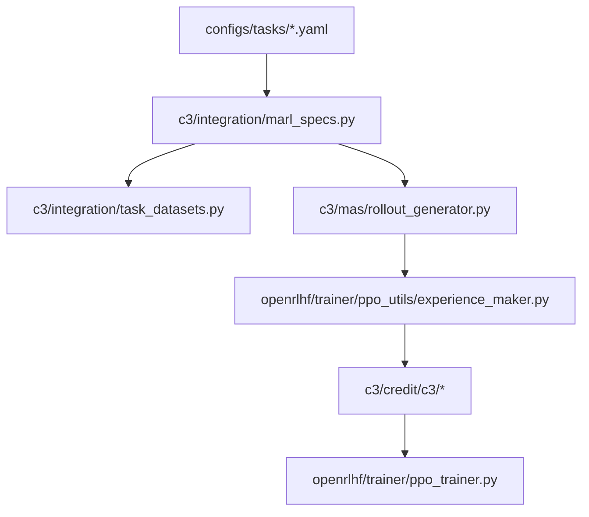

# Code Map

This document is a quick navigation guide to the repository. It is intentionally shorter than [IMPLEMENTATION_AUDIT.md](IMPLEMENTATION_AUDIT.md): the goal here is to help readers find the right entrypoint quickly.

## Top-level layout

- `c3/`: project-native code
- `openrlhf/`: vendored upstream training stack with C3 integrations
- `configs/`: task, role, registry, analysis, and data-manifest config
- `scripts/`: reproducibility, data preparation, audit, and helper scripts
- `docs/`: release policy, code audit, provenance, and user-facing documentation

## Where to look first

### I want to understand the paper path

1. [configs/tasks/math.yaml](../configs/tasks/math.yaml)
2. [configs/tasks/code.yaml](../configs/tasks/code.yaml)
3. [c3/integration/marl_specs.py](../c3/integration/marl_specs.py)
4. [c3/integration/task_datasets.py](../c3/integration/task_datasets.py)
5. [c3/mas/rollout_generator.py](../c3/mas/rollout_generator.py)
6. [openrlhf/trainer/ppo_utils/experience_maker.py](../openrlhf/trainer/ppo_utils/experience_maker.py)
7. [c3/credit/c3/](../c3/credit/c3)

### I want to run the repository

- fast smoke: [scripts/reproduce/smoke.sh](../scripts/reproduce/smoke.sh)
- data prep: [scripts/data/prepare_all.sh](../scripts/data/prepare_all.sh)
- training matrix: [scripts/reproduce/paper_train.sh](../scripts/reproduce/paper_train.sh)
- main-results sweep: [scripts/reproduce/paper_main_results.sh](../scripts/reproduce/paper_main_results.sh)
- analysis figures: [scripts/reproduce/paper_analysis_figs.sh](../scripts/reproduce/paper_analysis_figs.sh)
- release audit: [scripts/audit/pre_release.sh](../scripts/audit/pre_release.sh)

### I want to understand the environments

- math reward entry: [c3/envs/math/reward.py](../c3/envs/math/reward.py)
- code reward entry: [c3/envs/code/reward.py](../c3/envs/code/reward.py)
- code executor: [c3/envs/code/executor.py](../c3/envs/code/executor.py)
- environment dispatch: [c3/envs/registry.py](../c3/envs/registry.py)

### I want to understand the baselines

- MAPPO baseline: [c3/algorithms/mappo.py](../c3/algorithms/mappo.py)
- MAGRPO baseline: [c3/algorithms/magrpo.py](../c3/algorithms/magrpo.py)
- C3 fallback: [c3/algorithms/c3.py](../c3/algorithms/c3.py)
- algorithm naming and normalization: [c3/algorithms/registry.py](../c3/algorithms/registry.py)

### I want to understand evaluation and paper tables

- main-results aggregation: [c3/tools/main_results.py](../c3/tools/main_results.py)
- analysis aggregation: [c3/tools/analysis_results.py](../c3/tools/analysis_results.py)
- plotting: [c3/tools/plot_paper_figures.py](../c3/tools/plot_paper_figures.py)
- analysis CLI: [c3/analysis/c3_analysis.py](../c3/analysis/c3_analysis.py)

## Core-path vs fallback-path

### Core C3 path

### Important note

The paper-facing C3 implementation is **not** centered on `c3/algorithms/c3.py`. That file exists for compatibility and fallback behavior. The primary node-level credit path is:

- [openrlhf/trainer/ppo_utils/experience_maker.py](../openrlhf/trainer/ppo_utils/experience_maker.py)
- [c3/credit/c3/provider.py](../c3/credit/c3/provider.py)
- [c3/credit/c3/materialize.py](../c3/credit/c3/materialize.py)

## Configuration single sources of truth

- dataset provenance and SHA pins: [configs/data_manifest.yaml](../configs/data_manifest.yaml)
- main-results registry: [configs/main_results_registry.yaml](../configs/main_results_registry.yaml)
- analysis defaults: [configs/analysis.yaml](../configs/analysis.yaml)
- task configs: [configs/tasks/](../configs/tasks)
- role configs: [configs/roles/](../configs/roles)

## Related docs

- paper-to-code mapping: [IMPLEMENTATION_AUDIT.md](IMPLEMENTATION_AUDIT.md)
- release surface rules: [RELEASE_POLICY.md](RELEASE_POLICY.md)
- data provenance and strict verification: [DATA_SOURCES.md](DATA_SOURCES.md)
- upstream provenance: [UPSTREAM.md](UPSTREAM.md)
