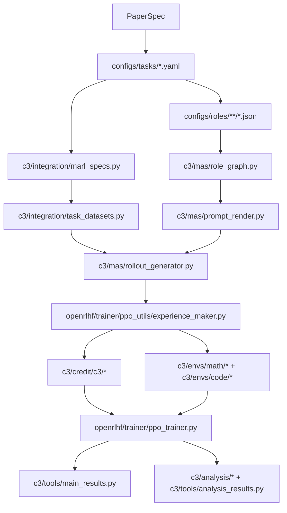

# Implementation Audit

This document maps the C3 paper to the implementation in this repository and records the main execution contracts that should remain stable across releases.

## Scope

- paper target: contextual counterfactual credit assignment for two-agent `Reasoner -> Actor` collaboration,
- repository target: public release of the reference implementation,
- audit goal: make the paper-facing path, compatibility path, and reproducibility path explicit.

## Core execution graph

## Paper-to-code matrix

| Paper area | Primary implementation | Role in repo | Key contract |
| --- | --- | --- | --- |
| Protocol and roles | `configs/tasks/math.yaml`, `configs/tasks/code.yaml`, `configs/roles/math/roles_duo.json`, `configs/roles/code/roles_duo.json` | Declares the paper-facing tasks and `Reasoner -> Actor` protocol | Task files are the paper defaults; role files define prompt text, dependencies, and `with_answer` |
| Task loading | `c3/integration/marl_specs.py` | Canonical loader for task and role configs | `TaskSpec` must expose environment, role graph, and dataset specs in a stable shape |
| Dataset loading | `c3/integration/task_datasets.py` | Converts task configs into HF datasets | Local dataset paths must resolve independent of cwd; eval suite names must remain stable |
| Multi-agent execution | `c3/mas/role_graph.py`, `c3/mas/prompt_render.py`, `c3/mas/rollout_generator.py` | Builds topo order, renders prompts, materializes MAS rollouts | Topology must remain acyclic; prompt rendering must be deterministic; rollout metadata feeds downstream credit/reward |
| C3 credit path | `openrlhf/trainer/ppo_utils/experience_maker.py`, `c3/credit/c3/provider.py`, `c3/credit/c3/materialize.py`, `c3/credit/c3/baselines.py` | Computes per-node credit and broadcasts token-level advantages | This is the real C3 path used by training |
| MAPPO baseline | `c3/algorithms/mappo.py` | Step-level GAE baseline | Consumes step-ordered episode tensors and returns scalar advantages/returns |
| MAGRPO baseline | `c3/algorithms/magrpo.py` | Group-based baseline | Computes group-centered advantages, then broadcasts them over action tokens |
| C3 fallback | `c3/algorithms/c3.py` | Compatibility and fallback path only | Not the paper’s primary C3 implementation |
| Training entry | `openrlhf/cli/train_ppo_ray_tooling.py`, `openrlhf/cli/train_ppo_ray.py`, `openrlhf/trainer/ppo_trainer.py` | Normalizes args, creates critics, drives PPO/Q-critic training | `marl_algorithm=auto` does not imply `c3`; Q-critic is enabled only for specific C3 variants |
| Math evaluation | `c3/envs/math/reward.py`, `c3/envs/math/backends/marft/*` | Math reward and answer checking | Current paper path scores only the final actor output |
| Code evaluation | `c3/envs/code/reward.py`, `c3/envs/code/executor.py` | Code reward and sandboxed execution | Reward is a pass-rate style score based on hidden tests in metadata |
| Paper main results | `scripts/reproduce/paper_main_results.sh`, `c3/tools/main_results.py`, `configs/main_results_registry.yaml` | Eval-only sweep and table aggregation | Datasource names must match task-suite names and registry expectations |
| Paper analyses | `scripts/reproduce/paper_analysis_figs.sh`, `c3/analysis/*`, `c3/tools/analysis_results.py`, `c3/tools/plot_paper_figures.py` | Credit, influence, variance, and plotting pipeline | Bucket metadata is the contract for downstream metrics |

## Primary paper-facing defaults

### Tasks

- `math`: `configs/tasks/math.yaml`
- `code`: `configs/tasks/code.yaml`

### Roles

- math duo: `configs/roles/math/roles_duo.json`
- code duo: `configs/roles/code/roles_duo.json`

### Main-results entrypoints

- training: `scripts/reproduce/paper_train.sh`
- eval-only sweep: `scripts/reproduce/paper_main_results.sh`
- analyses: `scripts/reproduce/paper_analysis_figs.sh`
- fast wiring check: `scripts/reproduce/smoke.sh`

## Core-path vs compatibility-path

### Paper core path

The paper’s C3 path is:

1. `train_ppo_ray_tooling.py` normalizes the run configuration,
2. `train_ppo_ray.py` decides whether a Q-critic is needed,
3. `ppo_trainer.py` prepares Q-critic batches,
4. `experience_maker.py` materializes tree groups and requests node-level C3 credit,
5. `c3/credit/c3/provider.py` computes scalar credit values,
6. the scalar credit is broadcast back to token-level PPO advantages.

### Compatibility or fallback paths

- `c3/algorithms/c3.py` is a fallback and compatibility calculator, not the main C3 algorithm.
- `c3_env_smoke.py` contains compatibility bridging for task loading and should not be used as proof that the training path is correct.
- `configs/roles/critic_preamble.json` is not part of the default paper path and should be treated as optional or experimental until its consumer contract is documented more clearly.

## Release-critical invariants

1. `TaskSpec` must expose `train_datasets` and `eval_suites` in a shape directly consumable by `load_task_datasets()`.
2. Eval suite names in task YAML must propagate into dataset `datasource` names unchanged, because `main_results.py` aggregates by benchmark name.
3. Local dataset paths such as `data/MATH/train.jsonl` must resolve from any working directory, not only when the process runs from repo root.
4. The public release must document that the actual C3 credit path lives in `experience_maker.py` plus `c3/credit/c3/*`, not in `c3/algorithms/c3.py`.
5. The public release must keep generated directories (`data/`, `artifacts/`, `ckpt/`, `runs/`, `wandb/`, `models/`) out of the shipped repository surface.

## Known interpretation notes

- `marl_algorithm=auto` for MAS tasks resolves to `magrpo` when `K > 1`; users must explicitly request `c3` for the paper method.
- The math paper path scores the final actor output. Multi-answer aggregation settings in `MathEnv` should be interpreted with that default in mind.
- The code path relies on tests embedded in dataset metadata; it is not symmetric with the math path’s `answer` field.
- `smoke.sh` is a wiring smoke test, not a performance regression test.

## Minimum verification targets

- task and role loading,
- dataset loading and benchmark naming,
- cwd-independent local path resolution,
- `RoleGraph` validity checks,
- prompt rendering contract,
- smoke-level math/code evaluator wiring,
- main-results aggregation on synthetic artifacts,
- analysis bucket parsing and metric aggregation.
